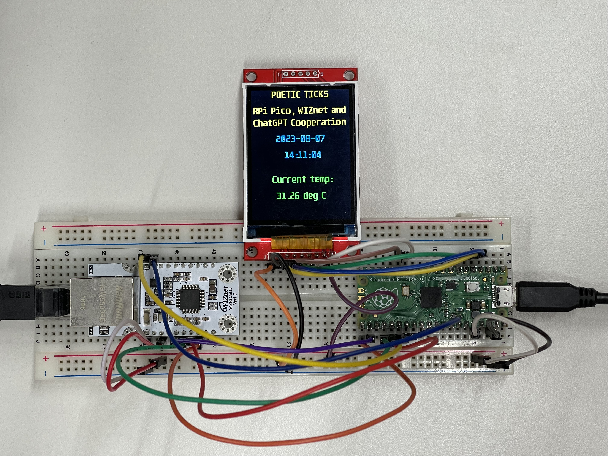
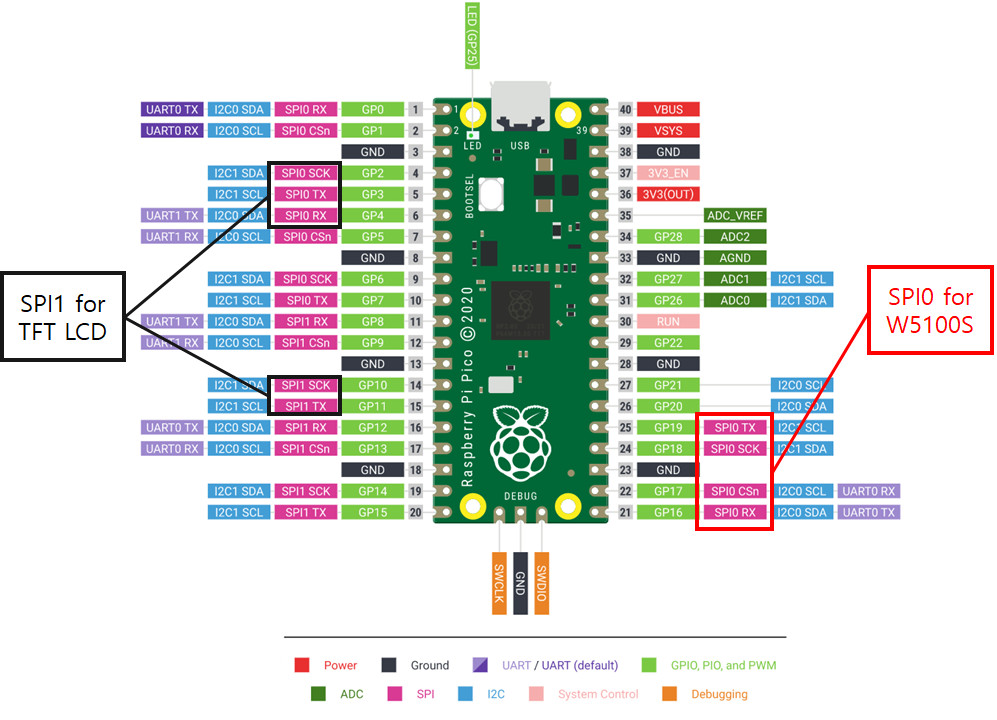
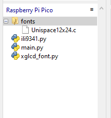
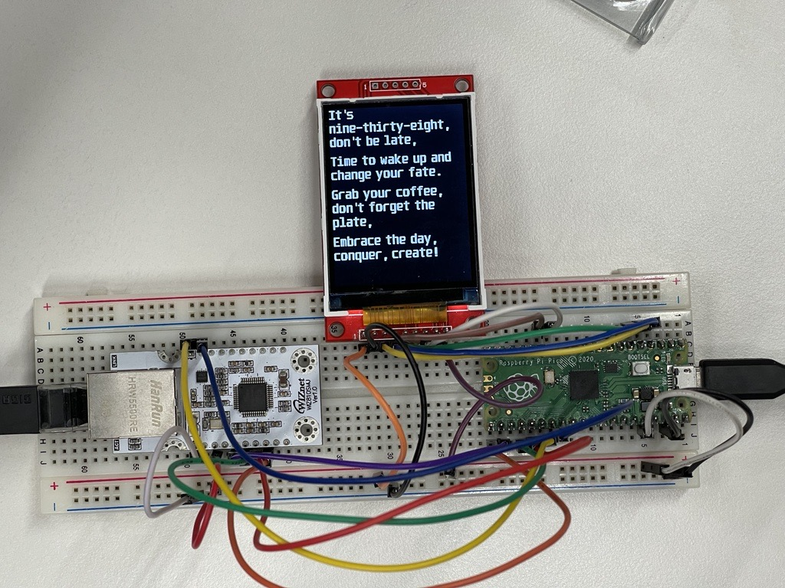
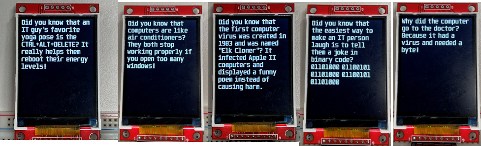

# W5100S-Pico-AI-Clock

A Raspberry Pi Pico device displaying time, temperature, and ChatGPT-generated poems or jokes at set intervals.

# Poetic Ticks - AI clock using RPi Pico, W5100S and ChatGPT

## 1. Introduction

Poetic Ticks is an innovative and multi-functional device that marries the practicality of a digital clock and thermometer with the whimsy of a joke and poem generator. This project is driven by the Raspberry Pi Pico, a compact and versatile microcontroller board, and utilizes the capabilities of ChatGPT, an advanced language model developed by OpenAI. For network connection I am using WIZnet's W5100S in a WIZ810SMJ module. It is possible to replace the boards with WIZnet Ethernet HAT or W5100S/W5500-EVB-Pico.



Upon initialization, Poetic Ticks synchronizes its time with an NTP server to ensure accurate timekeeping. It then displays the current time and temperature on an LCD screen, providing users with essential information at a glance. The temperature is measured using a digital temperature sensor interfaced with the Raspberry Pi Pico.

But Poetic Ticks offers more than just time and temperature readings. At every specified interval, the device sends a request to ChatGPT via OpenAI's API to generate a poem or a joke. The generated content is then displayed on the same LCD screen, infusing a touch of humor or poetry into the user's day.

## 2. Connection diagram



I used SPI0 to connect Pico with W5100S and SPI1 to connect with TFT LCD

## 3. The code

!!! To run the below code, it is needed to flash Pico with firmware that supports wiznet5k library.

To work with the display I used the code from https://github.com/rdagger/micropython-ili9341/tree/master

I copied ili9341.py, xglcd_font.py and Unispace12x24.c into the Pico.



In my project there are 3 display-related methods:

1. **display_init** function to initialize SPI communication with LCD

```python
def display_init():
    # Baud rate of 40000000 seems about the max
    displayspi = SPI(1, baudrate=40_000_000, sck=Pin(10), mosi=Pin(11))
    display = Display(displayspi, dc=Pin(4), cs=Pin(3), rst=Pin(2),rotation=180)
       
    return display
```
2. *8staticDisplay** function that will show current time and temperature. I am in GMT +9 zone, that's why offset was used.

```python
def staticDisplay(display, font, temp):

    display.draw_text(50, 0, 'POETIC TICKS', font,
                      color565(255, 128, 0))
    display.draw_text(5, 40, 'RPi Pico, WIZnet and', font,
                      color565(255, 128, 0))
    display.draw_text(5, 70, 'ChatGPT Cooperation', font,
                      color565(255, 128, 0))
    year, month, day, hour, minute, second, _, _ = time.localtime(time.time() + UTC_OFFSET)
    display.draw_text(60, 110, "{:04d}-{:02d}-{:02d}".format(year, month, day), font,
                      color565(0, 128, 255))
    display.draw_text(80, 150, "{:02d}:{:02d}:{:02d}".format(hour, minute, second), font,
                      color565(0, 128, 255))
    display.draw_text(50, 210, "Current temp:", font,
                      color565(0, 128, 0))
    display.draw_text(60, 250, "{:.2f} deg C".format(temp), font,
                      color565(0, 128, 0))
```
3. **draw_long_text** function that will display text received from ChatGPT. The logic is simple. LCD, that I am using, can contain around 20 symbols per line. I split the text into lines and check its length, if it is over the limit, then I split the line into words and print.

For better visibility I added extra 10 pixels between lines.
```python
def draw_long_text(display, font, text):
    textlines = text.split("\n")
    line_height = 25  # Adjust line height according to your font
    y=0
    for textline in textlines:
        line = ""
        if len(textline) <=20:
            display.draw_text(0, y, textline, font, color565(255, 255, 255))
            y += line_height + 10

        else:
            words = textline.split()
            for word in words:
                if (len(line) + len(word)) <= 20:
                    line += word + " "
                else:
                    display.draw_text(0, y, line, font, color565(255, 255, 255))
                    y += line_height
                    line = word + " "
                
                display.draw_text(0, y, line, font, color565(255, 255, 255))
            y += line_height + 10
```
Network related functions were taken from my previous project. There are only 2 functions:

* w5x00_init - to initialize W5100S
* chatgpt_request - this function will initiate a HTTP request to OpenAI API. As my screen is small, I had to make sure that the text length will not exceed 200.

In the main() the code does following:

* initialize WIZnet W5100S with static IP and LCD display
* Pico is synchronized with NTP server (I am aware of RTC, but since network is available, why* not use the NTP?)
* initialize ADC to measure temperature
* load fonts
* create time stamps before the loop starts. To save my limits on OpenAI API, the code displays poem with time every 15 minutes and random IT joke every hour.

## 4. The results

As mentioned, every 15 minutes ChatGPT-generated poem will be shown on display


And every hour, there will be shown a IT-related joke. I wish it would be possible to have the humor settings like in Interstellar :)

P.S. if you know how to improve my prompt, let me know please


## 5. The conclusion

Poetic Ticks is an prototype project for those interested in exploring the capabilities of the Raspberry Pi Pico, WIZnet chips and AI. It demonstrates how to interface the Pico with various components, such as an W5100S or LCD screen, and how to integrate it with an AI model. Moreover, it showcases the potential of AI in creating interactive and entertaining devices.